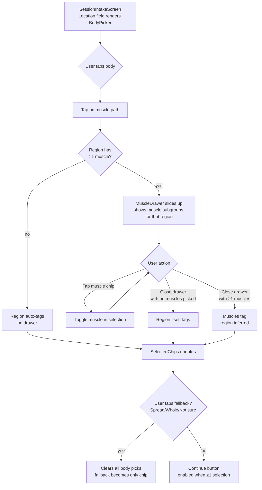

# Visual Body Picker — Design Spec

**Authority:** PT clinical pass 2 — refinement brainstorm 2026-05-04
**Status:** Draft for review (option C selected from mockup comparison)
**Mockup:** `docs/superpowers/specs/2026-05-04-body-picker-mockups.html`

---

## Goal

Replace the current chip-grid `Location` field on `SessionIntakeScreen` with an interactive anatomical body picker (anterior + posterior views) that lets the user identify focus areas at the **region level** with optional **muscle-level** precision via a bottom-sheet drawer.

Solves: chip-grid feels overwhelming with 23 entries; visual mode is denser yet calmer because only the regions that matter to a given user are ever surfaced as labels.

## Architecture

Three new components composed under a single `<BodyPicker>` wrapper that drops into `SessionIntakeScreen.tsx` where the chip grid currently lives.

```
SessionIntakeScreen
  └─ BodyPicker
       ├─ BodyPickerSVG       (anterior + posterior, all muscle paths)
       ├─ MuscleDrawer        (bottom-sheet, opens on region tap)
       └─ SelectedChips       (region + muscle chips with X-to-remove)
```

Path data is vendored from **vulovix/body-muscles** (Apache-2.0). It lives under `src/components/BodyPicker/data/` alongside the LICENSE and NOTICE files.

## UX Flow



### Specific interactions

| Trigger | Behavior |
|---|---|
| Hover a muscle (desktop) | Region name appears in tooltip above body; all muscles in that region brighten |
| Tap a muscle (mobile/desktop) | If region has muscle subgroups → drawer opens; if region has only one muscle path → region auto-tags without drawer |
| Tap a muscle chip in drawer | Toggle muscle in selection; chip below body updates |
| Close drawer (✕) | If ≥1 muscle was selected: those muscles stay; if zero: region itself becomes the tag |
| Tap chip's ✕ | Removes that chip (region or muscle); does not affect siblings |
| Tap *Spread/Whole/Not sure* | Clears all body picks; fallback becomes the only selection |
| Continue | Enabled when total selections ≥ 1 (region OR muscle OR fallback) |

### Mobile-specific touches

- The tooltip from desktop is replaced by a small **"currently active" strip** above the bodies that updates on touch-press (before commit). Disappears on release.
- Drawer height: max 70% of stage; scrolls if muscles overflow.
- Drawer dismissal: tap ✕, tap outside the drawer, or scroll content area underneath (the latter is a stretch goal).

## Data Model

### New types in `src/types/hari.ts`

```ts
/**
 * BodyMuscle — anatomical muscle subgroup beneath a BodyLocation region.
 * Source path data: vulovix/body-muscles (Apache-2.0).
 * Each muscle's parent region is encoded in MUSCLE_TO_REGION map (see
 * src/components/BodyPicker/data/regions.ts).
 */
export type BodyMuscle =
  // Front (40 muscles)
  | 'head_front'             // → region: head_temples
  | 'face_front'             // → region: jaw_tmj_facial
  | 'neck_left' | 'neck_right'
  | 'shoulder_front_left' | 'shoulder_side_left'
  | 'shoulder_front_right' | 'shoulder_side_right'
  | 'biceps_left' | 'forearm_left' | 'elbow_left'
  | 'biceps_right' | 'forearm_right' | 'elbow_right'
  | 'chest_upper_left' | 'chest_lower_left'
  | 'chest_upper_right' | 'chest_lower_right'
  | 'abs_upper_left' | 'abs_lower_left'
  | 'abs_upper_right' | 'abs_lower_right'
  | 'serratus_anterior_left' | 'serratus_anterior_right'
  | 'obliques_left' | 'obliques_right'
  | 'hip_flexor_left' | 'hip_flexor_right'
  | 'adductors_left' | 'adductors_right'
  | 'quads_left' | 'quads_right'
  | 'tibialis_anterior_left' | 'tibialis_anterior_right'
  | 'knee_front_left' | 'knee_front_right'
  | 'foot_front_left' | 'foot_front_right'
  | 'hand_front_left' | 'hand_front_right'
  // Back (49 muscles)
  | 'head_back'
  | 'nape'
  | 'traps_upper_left' | 'traps_mid_left' | 'traps_lower_left'
  | 'traps_upper_right' | 'traps_mid_right' | 'traps_lower_right'
  | 'lats_upper_left' | 'lats_mid_left' | 'lats_lower_left'
  | 'lats_upper_right' | 'lats_mid_right' | 'lats_lower_right'
  | 'deltoid_rear_left' | 'deltoid_rear_right'
  | 'triceps_long_left' | 'triceps_lateral_left'
  | 'triceps_long_right' | 'triceps_lateral_right'
  | 'forearm_flexors_left' | 'forearm_extensors_left'
  | 'forearm_flexors_right' | 'forearm_extensors_right'
  | 'spine'
  | 'lower_back_erectors_left' | 'lower_back_ql_left'
  | 'lower_back_erectors_right' | 'lower_back_ql_right'
  | 'gluteus_medius_left' | 'gluteus_maximus_left'
  | 'gluteus_medius_right' | 'gluteus_maximus_right'
  | 'hamstrings_medial_left' | 'hamstrings_lateral_left'
  | 'hamstrings_medial_right' | 'hamstrings_lateral_right'
  | 'calves_gastroc_medial_left' | 'calves_gastroc_lateral_left' | 'calves_soleus_left'
  | 'calves_gastroc_medial_right' | 'calves_gastroc_lateral_right' | 'calves_soleus_right'
  | 'knee_back_left' | 'knee_back_right'
  | 'foot_back_left' | 'foot_back_right'
  | 'hand_back_left' | 'hand_back_right'
```

### `HariSessionIntake` change

`location: BodyLocation[]` stays as the **canonical engine input** (the engine reads regions, not muscles). A new optional sibling field captures the muscle-level detail when the user provides it:

```ts
export interface HariSessionIntake {
  // ... existing fields ...
  location: BodyLocation[]                // unchanged — engine reads this
  location_muscles?: BodyMuscle[]         // NEW — captured but engine doesn't read yet
  // ... rest unchanged ...
}
```

**Rule:** every entry in `location_muscles` must roll up to a region present in `location[]`. The picker enforces this — selecting a muscle automatically adds its parent region. Removing a region also clears any muscles within that region.

### `MUSCLE_TO_REGION` map

A pure-data file in `src/components/BodyPicker/data/regions.ts`:

```ts
export const MUSCLE_TO_REGION: Record<BodyMuscle, BodyLocation> = {
  head_face_front: 'head_temples',
  neck_left: 'neck',
  neck_right: 'neck',
  shoulder_front_left: 'shoulder_left',
  // ... full mapping for all 50+ muscles ...
}
```

Used by the picker to roll muscle selections up into the canonical `location[]`.

## Components

### `src/components/BodyPicker/BodyPicker.tsx`

**Props:**
```ts
interface BodyPickerProps {
  selectedRegions: BodyLocation[]
  selectedMuscles: BodyMuscle[]
  fallback: 'spread_multiple' | 'whole_body' | 'not_sure' | null
  onChange: (next: {
    regions: BodyLocation[]
    muscles: BodyMuscle[]
    fallback: typeof fallback
  }) => void
}
```

**Owns:**
- The composition of SVG + drawer + chip list + fallback row
- Toggle logic for fallback (clears regions/muscles, etc.)
- Drawer open/close state
- Click handlers that wire the SVG `<g>` elements

**Doesn't own:**
- Persistence (parent `SessionIntakeScreen` does that on submit)
- Continue button (the parent screen's job)
- The HARI intake state shape

### `src/components/BodyPicker/BodyPickerSVG.tsx`

Renders both anterior and posterior SVG bodies. Each muscle is a `<path>` inside a `<g class="region" data-region="...">` element grouped by mediCalm region.

**Props:**
```ts
interface BodyPickerSVGProps {
  side: 'front' | 'back'
  selectedRegions: BodyLocation[]
  selectedMuscles: BodyMuscle[]
  onRegionTap: (region: BodyLocation) => void
  onRegionHover: (region: BodyLocation | null) => void
}
```

ViewBox: `"0 0 35 93"` for front, `"37 0 35 93"` for back (matches vulovix coordinate system).

### `src/components/BodyPicker/MuscleDrawer.tsx`

Bottom-sheet that slides up from the picker stage when a region with multiple muscles is tapped.

**Props:**
```ts
interface MuscleDrawerProps {
  region: BodyLocation | null      // null = closed
  selectedMuscles: BodyMuscle[]
  onToggleMuscle: (muscle: BodyMuscle) => void
  onClose: () => void
}
```

When `region === null`, drawer is hidden (`transform: translateY(100%)`). When set, slides up.

### `src/components/BodyPicker/data/muscles.ts`

Pure data file. Exports `MUSCLE_PATHS: { id: BodyMuscle, name: string, path: string, view: 'front' | 'back', region: BodyLocation }[]`.

**Top of file:**
```ts
/*
 * Anatomical SVG path data adapted from:
 *   vulovix/body-muscles · https://github.com/vulovix/body-muscles
 *   Copyright 2024 Ivan Vulović
 *   Licensed under the Apache License, Version 2.0
 *
 * Modifications from source:
 *   - id values renamed to mediCalm BodyMuscle convention
 *   - region key added (mediCalm BodyLocation)
 *   - File converted from default export to named MUSCLE_PATHS export
 *
 * Path geometry is verbatim. LICENSE and NOTICE files preserved alongside
 * this file at LICENSE-body-muscles, NOTICE-body-muscles.
 */
```

### `src/components/BodyPicker/LICENSE-body-muscles` and `NOTICE-body-muscles`

Verbatim copies from the source repo. Required by Apache-2.0 §4.

## Data Flow

```
User taps a muscle path in BodyPickerSVG
  → onRegionTap(region) fires
  → BodyPicker checks: does region have >1 muscle?
       yes → opens drawer with that region; no auto-tag yet
       no  → adds region to selection directly
  → onChange propagates {regions, muscles, fallback} to SessionIntakeScreen

User taps muscle chip inside drawer
  → onToggleMuscle(muscle) fires
  → BodyPicker toggles muscle in selectedMuscles[]
  → Auto-adds parent region to selectedRegions[] if not already there
  → onChange propagates

User closes drawer
  → If no muscles for the active region were picked: add region to selectedRegions
  → Drawer closes; selection unchanged

User taps chip's ✕
  → If chip is region: remove from regions[] AND remove all muscles whose parent is that region
  → If chip is muscle: remove muscle; leave parent region as-is
  → If chip is fallback: clear fallback

User taps a fallback button
  → Clear regions[], muscles[]; set fallback to that value (or null if same one re-tapped)

SessionIntakeScreen submit
  → Reads {regions, muscles, fallback}
  → Sets HariSessionIntake.location = regions
  → Sets HariSessionIntake.location_muscles = muscles
  → Fallback selections map to a single region: 'spread_multiple' | 'whole_body' | 'not_sure'
```

## Engine Impact

**Zero engine change.** The HARI engine reads `intake.location: BodyLocation[]` exactly as it does today. Muscles are recorded for future use (e.g. M7+ fine-grained adaptation) but no current engine pathway consumes them.

This is intentional — it lets the UX upgrade ship without forcing engine changes, and gives later work a real data set to calibrate against.

## Error Handling / Edge Cases

| Case | Behavior |
|---|---|
| User selects a muscle, then removes its parent region via chip ✕ | All muscles whose parent is that region are also removed |
| User selects fallback while regions+muscles already picked | Clear regions[] and muscles[]; fallback becomes only selection |
| User closes drawer with zero muscles picked | The active region is added (drawer was a confirmation step) |
| User opens drawer for a region with only one muscle path | Drawer never opens — region auto-tags directly |
| Persisted record from before this feature (`location_muscles` undefined) | Treated as empty; fully forward-compatible |
| Persisted record from current build (location: BodyLocation[] only) | Body picker pre-fills regions; muscles array stays empty |
| User taps the same muscle twice in drawer | First tap selects, second deselects |
| User accidentally taps near body but not on a path | No-op — only path elements have click handlers |

## Testing Strategy

**Unit (Vitest + Testing Library):**
- `BodyPicker.test.tsx`
  - Renders both front and back SVGs
  - Tap a region with single muscle → adds region without opening drawer
  - Tap a region with multiple muscles → opens drawer
  - Toggle muscle in drawer → adds muscle + parent region
  - Close drawer with no muscles picked → tags the region
  - Close drawer with muscles picked → muscles + region both present
  - Tap fallback → clears regions and muscles
  - Tap chip ✕ on region → removes region AND any muscles in that region
  - Tap chip ✕ on muscle → removes muscle only, region stays
- `data/regions.test.ts`
  - Every BodyMuscle maps to a valid BodyLocation
  - Every muscle in MUSCLE_PATHS appears in MUSCLE_TO_REGION

**Integration (SessionIntakeScreen.test.tsx):**
- Submitting with body picker selections produces correct `location` and `location_muscles` in the intake payload
- Selecting only via fallback produces `location: ['whole_body']` (or equivalent) and empty `location_muscles`
- Continue button gates on body picker selection (replacing existing chip-grid gating)

**E2E (Playwright baseline-capture.spec.ts):**
- Update `12 — intake screen filled` and golden path to tap a body region instead of a chip
- Add `12b — intake with muscle drawer open` capturing the drawer state
- Verify visual baseline doesn't drift across deployments

## Build Order

Single implementation plan, ten tasks (rough). Each is a TDD cycle (write failing test, implement minimal, commit):

1. Vendor muscle path data and license/notice files (data only, no UI yet)
2. Add `BodyMuscle` type + `MUSCLE_TO_REGION` map + tests
3. Build `BodyPickerSVG` component, render-only, no interaction
4. Add hover/tap interaction to `BodyPickerSVG`, lift events to parent
5. Build `MuscleDrawer` component, isolated test (open/close, muscle toggle)
6. Compose `BodyPicker` wrapper (SVG + drawer + chips + fallback row)
7. Wire region↔muscle bidirectional logic (auto-add region on muscle pick, remove muscles on region remove)
8. Replace `SessionIntakeScreen`'s Location chip-grid with `<BodyPicker>`
9. Update unit tests in `SessionIntakeScreen.test.tsx` for new picker
10. Update E2E baseline capture, regenerate snapshots, full vitest run

## Acceptance Criteria

- [ ] All 89 muscle paths render correctly on both front and back views
- [ ] Hovering any muscle highlights all muscles in its parent region
- [ ] Tapping a region with multiple muscles opens the drawer
- [ ] Tapping a region with one muscle auto-tags the region (no drawer)
- [ ] Closing drawer with zero muscles picked → region is tagged
- [ ] Closing drawer with ≥1 muscle picked → muscles + region both in selection
- [ ] Removing a region chip also removes its child muscles
- [ ] Removing a muscle chip leaves its parent region intact
- [ ] Fallback selection clears all body selections and vice-versa
- [ ] `HariSessionIntake.location` always equals the rolled-up region set
- [ ] `HariSessionIntake.location_muscles` reflects user's exact muscle picks
- [ ] Continue button enabled iff total selections ≥ 1
- [ ] All existing 248 vitest tests still pass
- [ ] E2E baseline regenerates clean
- [ ] Apache-2.0 LICENSE and NOTICE files present alongside vendored data
- [ ] Engine pipeline unchanged — `location: BodyLocation[]` is the only thing M4-M6 consume

## Out of Scope (Future Work)

- Animation polish on the muscle highlight (glow pulse, fade-in)
- Engine consumption of `location_muscles` (M7+ — would need clinical/PT input on muscle-level adaptation rules)
- Custom anatomical illustration (sticking with vulovix line-art for now; a designer pass could be a Phase 2)
- Female / non-binary body templates (vulovix is currently male-anatomical only)
- Saving body picker preferences to Body Context (M4.1) for pre-population on next session

## Attribution

Anatomical SVG path data adapted from **vulovix/body-muscles** (https://github.com/vulovix/body-muscles), Copyright 2024 Ivan Vulović, licensed under the Apache License, Version 2.0. The full LICENSE and NOTICE files are preserved at `src/components/BodyPicker/LICENSE-body-muscles` and `NOTICE-body-muscles`. Modifications: muscle ids renamed to mediCalm convention, region tagging added, file format converted to named exports.
