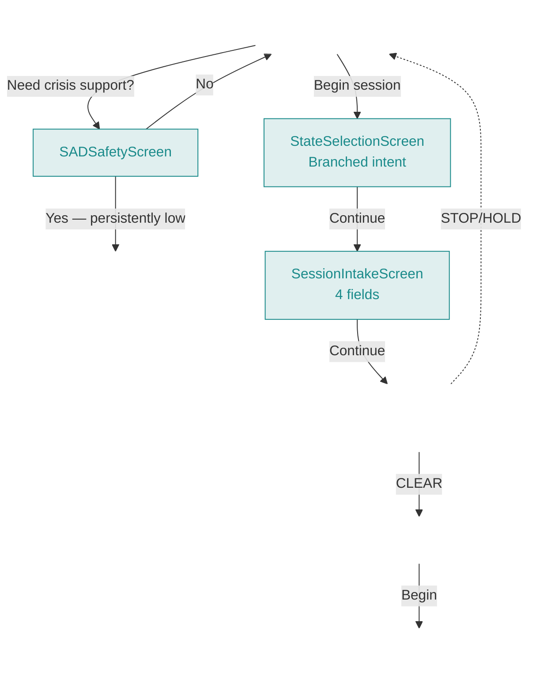
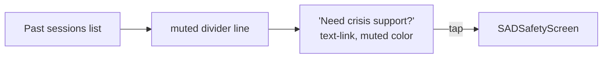
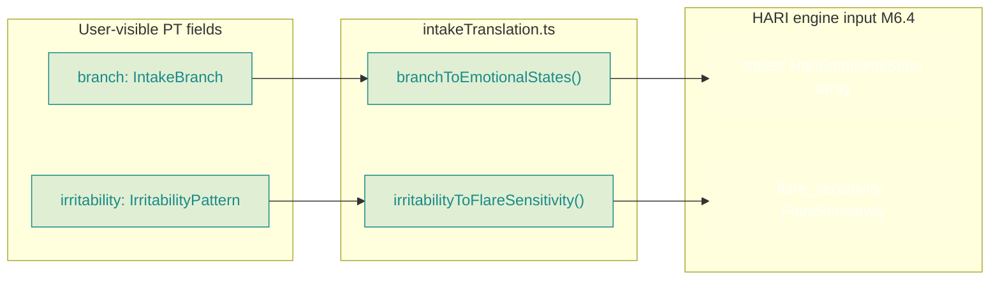
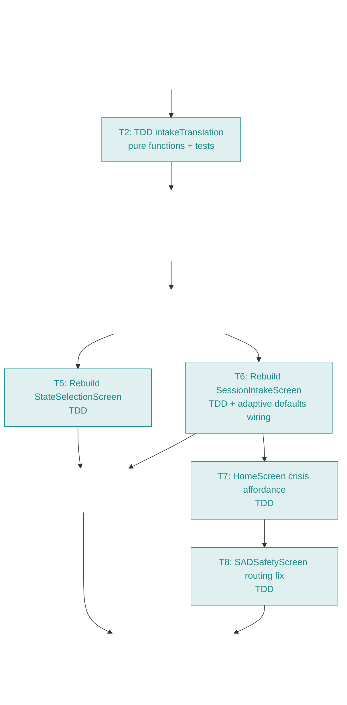
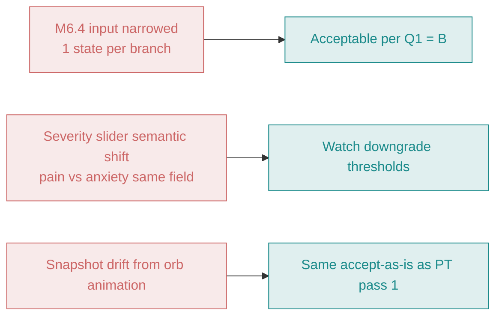

# PT Clinical Pass 2 — Intake Simplification + Irritability Pattern (Design)

**Authority:** PT clinical refinement notes 2026-05-02 §2 §3 §5; brainstorm session 2026-05-04 with user.
**Status:** Design approved — ready for implementation.
**Visual mockups:** [`2026-05-04-pt-clinical-pass-2-mockups.html`](./2026-05-04-pt-clinical-pass-2-mockups.html) — open in browser to see actual rendered screens (Deep Current dark theme, 4 device frames + flow diagram + translation panel).

---

## At a glance

| | Before | After |
|---|---|---|
| **Front-door question** | "What are you feeling right now?" — 7-state multi-select with Heavy expandable | "Why are you using the app today?" — 2-option branched intent |
| **Intake fields** | 6 (intent · context · focus · intensity · sensitivity · length) | 4 (severity · irritability · position · length) |
| **SAD safety trigger** | Selecting "Sad" inside the Heavy expandable | Quiet "Need crisis support?" link on HomeScreen |
| **M6 engine input** | 1–7 emotional states from multi-select | Always 1 emotional state, derived via translation layer |
| **Total user-visible decisions before session** | 13 | 4 |

---

## Goal

Replace the current 7-state multi-select intake + 6-field session intake with the PT advisor's branched 2-screen flow, while preserving the M6 engine investment via a translation layer. Add a quiet crisis-support affordance to `HomeScreen` so the SAD safety check is reachable independently of intake flow.

## Why this fits

The current intake interrogates: 13 user-facing decisions before a session can start. The PT's flow is structured like a real clinical encounter — short, two-question root, inferences pulled from history and engine. This pass adopts the PT-shaped front door without retiring the M6 intelligence behind it. The engine continues to receive the same `HariSessionIntake` shape it expects, just derived from fewer user-visible inputs through a small translation module.

Three concrete improvements:

1. **Less friction at the moment of pain** — a person reaching for the app while hurting can complete two screens, not seven.
2. **Irritability pattern is clinical signal** (Maitland classification), replacing the vague "how sensitive does your body feel" question with a precise descriptor.
3. **Crisis support stops hiding behind a multi-select** — pulled out as a quiet home-screen link, findable regardless of what the user said about their physical pain.

The cost: M6.4 input narrows to one emotional state per branch instead of up to seven. Multi-state expressive range is preserved only via R&D override paths.

---

## Visual reference

> **All four screen designs and the before/after flow live in the mockup file.** The diagrams in this markdown are summaries — go to the HTML for fidelity, color, spacing, and content.

| Frame | Mockup | Purpose |
|---|---|---|
| 1 | HomeScreen + crisis affordance | New "Need crisis support?" muted link below history; routes to `sad_safety` |
| 2 | StateSelectionScreen — branched | "Why are you using the app today?" with 2-option single-select |
| 3 | SessionIntakeScreen — pain branch | Severity reads "How severe is your tightness or pain right now?" |
| 4 | SessionIntakeScreen — anxious branch | Same fields, severity reads "How intense is it right now?" |

Open the [mockup HTML](./2026-05-04-pt-clinical-pass-2-mockups.html) to see all four side by side at full device fidelity.

---

## Architecture

### Flow diagram



### What changes
- `StateSelectionScreen`: 7-state multi-select → 2-option branched single-select
- `SessionIntakeScreen`: 6 fields → 4 fields, with branch-aware severity copy
- `HomeScreen`: adds quiet "Need crisis support?" affordance below history
- New module: `src/engine/intakeTranslation.ts` (pure functions)
- `SADSafetyScreen` "No" route: `session_intake` → `home`; "Back" route: `state_selection` → `home`
- `HariSessionIntake` interface: gains `branch` + `irritability`; `session_intent`, `symptom_focus`, `flare_sensitivity` become silently-derived

### What stays
- M6.4 state interpretation engine (consumes derived emotional state input)
- M6.5 session config / M6.8 breath family / M5.2 adaptive defaults / M7.1 adaptation
- HARI safety gate, session setup, guided session screens
- All 5 position options (PT spec literal was 3; activity context retained per user call)
- `SADSafetyScreen` "Yes" → `SupportResourcesScreen` routing
- `HistoryEntry` persistence shape (with new fields marked optional for backward compat)

### What's removed
- "Heavy" expandable subcategory and Sad/Angry/Overwhelmed sub-states
- Visible `session_intent` question (Quick reset / Deeper regulation / Flare-sensitive / Cautious test)
- Visible `symptom_focus` question (now silent default via M5.2 adaptive defaults)
- Visible `flare_sensitivity` question (replaced by irritability pattern)
- `'not_sure'` from `SessionLengthPreference`

---

## UI specification

> Visual fidelity in the [mockup HTML](./2026-05-04-pt-clinical-pass-2-mockups.html). The text below specifies copy, ordering, and semantics.

### Screen 1 — `StateSelectionScreen` (rebuilt)

**Header:** **"Why are you using the app today?"** (PT verbatim)
**Two large tap targets**, single-select radio behavior:
- **Tightness or pain**
- **Anxious or overwhelmed**

**Continue** enabled once one is selected; explicit Continue (not auto-advance).
**Back** routes to `HomeScreen`.

### Screen 2 — `SessionIntakeScreen` (rebuilt)

**Breadcrumb header:** `← Tightness or pain` (or `← Anxious or overwhelmed`) — tappable, returns to `StateSelectionScreen` with branch preselected.

**Field order:**

| # | Prompt | Type | Options |
|---|---|---|---|
| 1 | **"How severe is your tightness or pain right now?"** *(pain branch)* OR **"How intense is it right now?"** *(anxious branch)* | 0–10 slider | Default: 5 |
| 2 | **"How would you describe it?"** | 3-choice radio | "Comes on quickly, goes away slowly" · "Comes on slowly, goes away quickly" · "Comes on and goes away about the same" |
| 3 | **"Where are you right now?"** | 5-option radio | Sitting · Standing · Driving / in vehicle · Lying down · After strain or overuse |
| 4 | **"How long feels right today?"** | 3-option radio | Short · Standard · Longer |

**Continue:** enabled once irritability, position, and length are all set. (Severity defaults to 5; technically always set.)

### `HomeScreen` — crisis support affordance



- Placement: below past-sessions list, separated by quiet divider
- Copy: **"Need crisis support?"** — text-link style, muted color
- Routes: `dispatch({ type: 'NAVIGATE', screen: 'sad_safety' })`
- Intentionally low-prominence — present for those who need it, not promoted

### `SADSafetyScreen` routing fix
- "No" → `home` (was: `session_intake`)
- "Yes" → `support_resources` (unchanged)
- Back → `home` (was: `state_selection`)
- Origin-context awareness no longer required — single entry point now

---

## Translation layer (the engineering core)



### Mapping rules

| Input | → | Output |
|---|---|---|
| `branch: 'tightness_or_pain'` | → | `states: ['pain']` |
| `branch: 'anxious_or_overwhelmed'` | → | `states: ['anxious']` |
| `irritability: 'fast_onset_slow_resolution'` | → | `flare_sensitivity: 'high'` |
| `irritability: 'slow_onset_fast_resolution'` | → | `flare_sensitivity: 'low'` |
| `irritability: 'symmetric'` | → | `flare_sensitivity: 'moderate'` |

Single-state output per branch — PT used "or" between terms (synonyms, not a checklist). M6.4 unified mode handles single state cleanly.

### Module signature

```ts
// src/engine/intakeTranslation.ts
import type { HariEmotionalState, FlareSensitivity } from '../types/hari'
import type { IntakeBranch, IrritabilityPattern } from '../types/hari'

export function branchToEmotionalStates(b: IntakeBranch): HariEmotionalState[]
export function irritabilityToFlareSensitivity(p: IrritabilityPattern): FlareSensitivity
```

---

## Type changes — `HariSessionIntake`

```ts
export interface HariSessionIntake {
  // ─── Visible / user-set (PT pass 2) ─────────────────────────────────
  branch: IntakeBranch                                  // NEW
  irritability: IrritabilityPattern                     // NEW
  baseline_intensity: number                            // unchanged: 0–10 slider
  current_context: CurrentContext                       // unchanged: 5 options retained per user call
  session_length_preference: SessionLengthPreference    // narrowed

  // ─── Silent / derived ───────────────────────────────────────────────
  session_intent: SessionIntent                         // always 'quick_reset' (silent default)
  symptom_focus: SymptomFocus                           // M5.2 adaptiveIntakeDefaults; fallback 'spread_tension'
  flare_sensitivity: FlareSensitivity                   // derived via irritabilityToFlareSensitivity()
}
```

**`SessionLengthPreference`** narrows: `'shorter' | 'standard' | 'longer' | 'not_sure'` → `'short' | 'standard' | 'longer'`.

**`PersistedHariMetadata.intake`** widens via `Partial<HariSessionIntake>` to read pre-pass-2 history without crashing.

### `EntryState` (`pendingStateEntry`) shape change

```ts
// BEFORE
pendingStateEntry: EntryState[] | null   // multi-state array

// AFTER
pendingStateEntry: IntakeBranch | null   // single branch value
```

`pendingStateEntry` is per-session ephemeral state (not persisted to localStorage). Breaking change is safe — any in-flight session before the deploy is lost on refresh, which is already the existing contract. Action name `SET_STATE_ENTRY` is retained; only the payload shape changes.

---

## Routing edges

| Edge | Before | After |
|---|---|---|
| `HomeScreen` Begin session | → `state_selection` | → `state_selection` *(unchanged)* |
| `HomeScreen` Need crisis support? | *(didn't exist)* | → `sad_safety` |
| `StateSelectionScreen` Continue | → `sad_safety` if Sad selected, else `session_intake` | → `session_intake` |
| `SADSafetyScreen` "No" | → `session_intake` | → `home` |
| `SADSafetyScreen` "Yes" | → `support_resources` | → `support_resources` *(unchanged)* |
| `SADSafetyScreen` Back | → `state_selection` | → `home` |
| `SessionIntakeScreen` Continue | → `hari_safety_gate` | → `hari_safety_gate` *(unchanged)* |

---

## Build order



**Teal nodes are TDD** (test-first, then implementation, then commit). **Gray nodes are mechanical** (type/shape edits where TypeScript is the test).

---

## Migration concerns

### `HistoryEntry` records (persisted)
Existing entries store the old `HariSessionIntake` shape and lack `branch` / `irritability`. Solution: `PersistedHariMetadata.intake` becomes `Partial<HariSessionIntake>`. New entries get the new fields; reads of old entries treat them as `undefined`. `adaptiveIntakeDefaults` already has fallback behavior for missing fields — no migration script needed.

### `pendingStateEntry` shape
Per-session ephemeral, not persisted. Breaking change is safe.

---

## Risks



- **M6.4 input narrowed.** Always exactly 1 emotional state from production paths. Overload (5+) and prioritized (3-4) modes become unreachable except via R&D override. Acceptable per design call B in Q1; one-time visual check recommended that prescribed sessions still feel reasonable across both branches after deploy.
- **Severity slider semantic shift.** Pain branch = "how severe is your pain"; anxious branch = "how intense is the anxiety." Engine consumes both as `baseline_intensity` 0–10 — same field, different meaning. Downgrade thresholds (intensity ≥ 7) apply uniformly. If anxious users hit unexpected safety downgrades, this is the seam.
- **Playwright snapshot drift.** Most regenerated PNGs will be continuous-orb-animation noise; ~5 will have real visual content changes. Same accept-as-is approach as PT pass 1.

---

## Pre-existing issues we'll touch

- `App.test.tsx` routing failure (failing since PT pass 1 due to M6.6 routing change). We're rewriting `App.test.tsx` integration coverage anyway — fix this as part of the rewrite.
- `SADSafetyScreen.test.tsx` "No" routing assertions — update to assert `home` instead of `session_intake`.

## Pre-existing issues we won't touch (deferred)

- Atypical right-sided cardiac radiation copy (PT advisor question)
- Internal `shallow_breathing` symptom_tag rename (`taxonomy.ts`, `mechanisms.ts`, `interpretationLayer.ts`)
- Legacy R&D path cleanup (`PainInputScreen` / `SafetyStopScreen` / `RDReviewScreen`)
- M7 work (Entry Behavior Layer)
- M6.9 User Refinement Layer (locked for after M7.3)
- `feasibility.ts` and `setup.ts` pre-existing TS noise

---

## Testing strategy

- **Translation layer:** new `src/engine/intakeTranslation.test.ts` — both branches, all 3 irritability mappings, type-correctness assertions
- **`StateSelectionScreen`:** rewrite tests for 2-option radio + Continue + branch persistence to AppContext
- **`SessionIntakeScreen`:** rewrite tests — irritability options + branch-aware severity label + position 5-option set + length 3-option set + Continue gating
- **`HomeScreen`:** add assertion for "Need crisis support?" link presence + routing
- **`SADSafetyScreen`:** update "No" routing assertion to `home`
- **`App.test.tsx`:** at least one full-flow test from `state_selection` through `hari_safety_gate` via the new branched path
- **Playwright baseline:** regenerate via `npm run capture`; manual eyeball check of the ~5 real visual deltas before committing

---

## Rollout

Single feature branch (`m5-6-architecture-pass`), batched commits per build-order step, push to `origin`. Optional fast-forward merge of `main` to feature-branch tip after manual verification via the running ngrok tunnel. No production users, no migration window, no rollback plan needed.

## Authority chain

This spec extends:
- M4.2 MVP intake spec (defines existing `HariSessionIntake` 6-field shape)
- M6.1 State Selection Screen spec (defines existing 7-state multi-select)
- M6.1.1 SAD Safety Screen v2.1 (defines current SAD safety check)
- M6.4 State Interpretation Engine spec (consumer of emotional state input)
- PT clinical refinement notes 2026-05-02 (NEW — exogenous to markdown pack)

After this pass lands, the M6.1 and M6.1.1 specs should be amended with a "SUPERSEDED 2026-05-04: see PT clinical pass 2 design doc" note. Doc-update task, not code-update — separate from the implementation plan.
